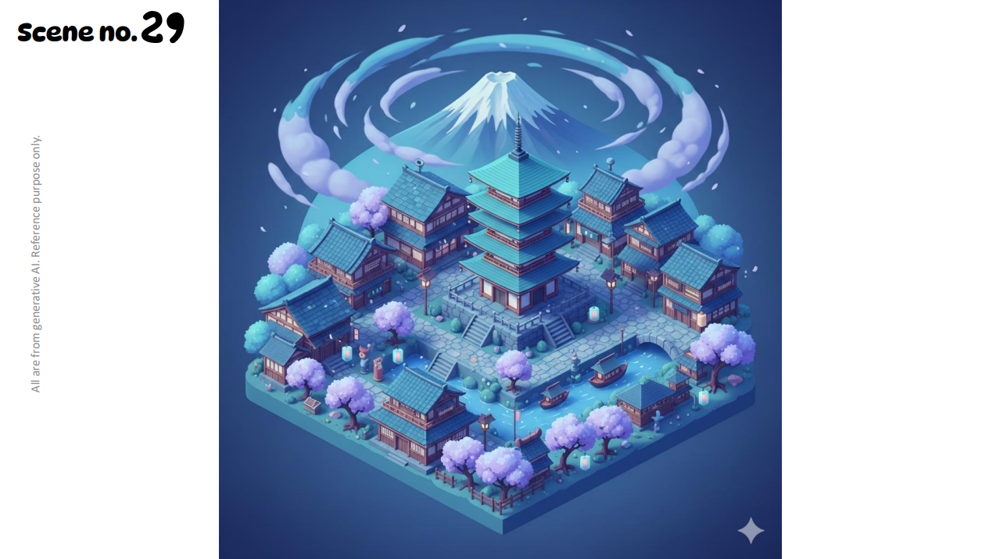

# Japanese-Town
### ITCS373 Creative Programming Individual challenge 1
This challenge requires me to create a Blender Python script that generates a scene as similar to the reference as possible. I am not permitted to use any Blender user interface except the render button.
### Reference

### Final Image 🥹
